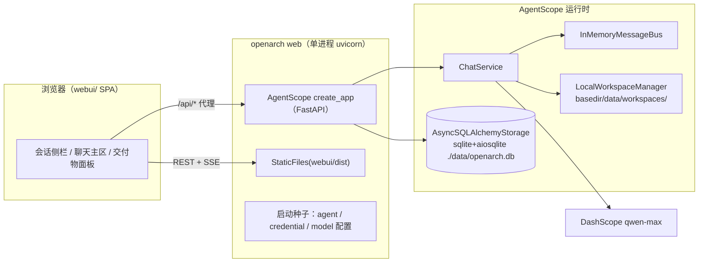

# OpenArch Phase 2 · 浏览器 Web UI 设计

> 状态：待用户审阅
> 日期：2026-08-31
> 前置：MVP（架构设计 Copilot）已完成并合入 main，设计见
> `2026-08-28-openarch-sa-platform-design.md`
> 探测基线：agentscope 2.0.7.post1（所有 API 均已对照本地安装源码逐一验证）

## 1. 背景与目标

MVP 通过 `launch_console` 在终端交付完整 Copilot 链路。Phase 2 将同一能力搬到浏览器：
会话管理、实时流式回复、Mermaid 架构图渲染、交付物浏览与下载。

设计立场（沿用 brainstorming 已确认结论）：

- **方案 A：自研轻量前端**。后端 100% 复用 AgentScope Agent Service（`create_app`），
  前端为 Vite + React + TS 单页应用，无路由/状态/UI 组件库，纯 CSS。
- 单用户、本地优先，与 MVP 的"一条命令跑起来"一致。
- console 模式（`openarch`）保持不变，Web 是新增入口而非替换。

## 2. 与 brainstorming 设计的两处探测后修正

设计阶段标记的探测点已全部关闭，其中两处与最初假设不同，按事实修正：

| 原假设 | 探测结果 | 修正 |
|---|---|---|
| 存在 `SQLiteStorage` 类 | 实际为 `AsyncSQLAlchemyStorage(url)`，SQLite 只是一个 URL 形态（`sqlite+aiosqlite:///...`） | 存储改用 `AsyncSQLAlchemyStorage`，需 `agentscope[service,storage-sql]` extras + `aiosqlite` 驱动 |
| 手动补装 `fastapi/uvicorn/apscheduler` | AgentScope 官方 extras：`service`（fastapi + uvicorn + apscheduler + ag-ui-protocol）、`storage-sql`（sqlalchemy[asyncio] + alembic） | 直接依赖官方 extras，不在 pyproject 手写这三个包 |

另一处重要发现（非修正，是设计依据的更新）：服务**不从** `build_agent()` 实例化 Agent，
而是从 DB 记录构建（`ChatService._chat.py:983`：`Agent(name, system_prompt, model, toolkit, ...)`,
模型由 `SessionConfig.chat_model_config.credential_id` 解析）。因此"复用 build_agent"
落地为三个官方注入点（见 §5.2），`build_agent` 仅保留给 console 模式。

## 3. 总体架构



- 一个进程：uvicorn 同时服务 API 与静态前端（`webui/dist` 存在时挂 `/`）。
- 一个 SQLite 文件：会话、消息、agent/凭证/模型配置全由 AgentScope 的存储层管理，
  OpenArch 不建自己的表。
- 技能包：`LocalWorkspaceManager(skill_paths=[<仓库>/skills])` 在每个新工作区种子
  OpenArch 技能，由 `workspace.list_skills()` 原生加载——与 console 模式同一套 `skills/`。

## 4. 范围（In Scope / Out of Scope）

**In：**

1. `openarch web` 子命令（host/port 可配）与启动自检
2. 服务装配模块 `src/openarch/web/`（app 工厂 + 种子逻辑 + OpenArch 工具注入）
3. webui 前端 SPA（三区布局、SSE 消费、Mermaid 渲染、交付物浏览/下载）
4. 配置扩展：`OPENARCH_DB` / `OPENARCH_HOST` / `OPENARCH_PORT`
5. Dockerfile 多阶段（node 构建前端 + python 运行时）
6. 测试：Python 装配测试、vitest 纯逻辑测试、手动验收清单

**Out（Non-Goals）：**

- 多用户认证、权限（沿用 `X-User-ID: local` 占位认证）
- 移动端适配、分享链接、会话导出
- Agent 管理界面（agent 记录由种子逻辑创建，前端不提供编辑）
- Phase 3+（客户管理、学习路径、多云知识包）
- Redis / Docker 工作区 / 频道集成等 AgentScope 可选后端

## 5. 后端设计

### 5.1 新模块 `src/openarch/web/`

    src/openarch/web/
    ├── __init__.py
    ├── app.py        # create_web_app(settings) -> FastAPI
    ├── bootstrap.py  # 幂等种子：credential / agent 记录
    └── tools_factory.py  # extra_agent_tools 工厂（会话工作区感知）

**app.py — `create_web_app(settings)`：**

```python
app = create_app(
    storage=AsyncSQLAlchemyStorage(
        f"sqlite+aiosqlite:///{settings.db}",
        create_tables=True,
    ),
    message_bus=InMemoryMessageBus(),
    workspace_manager=LocalWorkspaceManager(
        basedir=str(settings.workspace_root),
        skill_paths=[str(settings.skills_dir)],
    ),
    extra_agent_tools=make_openarch_tools,   # §5.2
    title="OpenArch",
)
```

### 5.2 OpenArch 能力注入（替代 build_agent 的三个官方接口）

| OpenArch 资产 | 注入点 | 机制 |
|---|---|---|
| 五件套工具 | `extra_agent_tools` 工厂 | 工厂签名 `(user_id, agent_id, session_id) -> list[ToolBase]`（异步）。闭包捕获 workspace_manager，按同一三元组 `resolve()` 会话工作区，以 `workdir` 实例化 `ValidateDiagramTool / ExportDrawioTool / ExtractRequirementsTool / ReviewWithWafTool / ExportDeliverableTool`——交付物因此落进会话工作区，可被文件 API 浏览 |
| 技能包 | `LocalWorkspaceManager(skill_paths=[...])` | 服务在新工作区种子技能目录，`get_toolkit()` 经 `workspace.list_skills()` 加载，与 console 同一套 `skills/`，零复制 |
| 系统提示词与 agent 身份 | 启动种子 | bootstrap 幂等 upsert agent 记录（name=`OpenArch`，system_prompt=`SYSTEM_PROMPT`） |

WAF 清单路径沿用 `ReviewWithWafTool(checklist_path)` 构造参数，指向 `<skills_dir>/aliyun-waf/checklist.yaml`，与 console 模式一致。

### 5.3 bootstrap 种子（幂等）

服务启动后、可服务前执行（app lifespan 内或 uvicorn 启动钩子，以探测结果定）：

1. 若无 `OpenArch` agent 记录 → 创建（system_prompt 复用 `agent.SYSTEM_PROMPT`）。
2. 若 `.env` 含 `DASHSCOPE_API_KEY`（或 `OPENARCH_API_KEY`）且 DB 无对应凭证 →
   `POST` 等价地 upsert `DashScopeCredential` 记录；key 只进服务端存储，
   凭证 API 返回视图若含明文则视为不可接受（验收时人工核对一次）。
3. 种子失败不阻塞启动，但 `GET /health` 之外的首次 `/chat` 会得到结构化错误提示。

### 5.4 CLI 与配置

```
openarch            # console 模式，行为不变
openarch web        # Web 模式：种子 → uvicorn.run(app, host, port)
```

配置新增（`config.py` 的 `Settings` 扩展）：

| 变量 | 必填 | 默认 | 说明 |
|---|---|---|---|
| `OPENARCH_DB` | 否 | `./data/openarch.db` | SQLite 文件路径 |
| `OPENARCH_HOST` | 否 | `127.0.0.1` | Web 监听地址 |
| `OPENARCH_PORT` | 否 | `8000` | Web 监听端口 |

工作区根：Web 模式取 `OPENARCH_DB` 所在目录下的 `workspaces/`（默认
`./data/workspaces`）。console 模式的 `OPENARCH_WORKSPACE`（默认
`./deliverables`）语义不变。

依赖变更（pyproject）：

```
"agentscope[service,storage-sql]>=2.0",
"aiosqlite>=0.20",
```

`webui` 构建产物不入 pyproject；`openarch web` 在 `webui/dist` 缺失时打印一行
提示（"前端未构建，仅 API 可用；构建方法见 README"）并以纯 API 模式继续。

### 5.5 探测确认的 API 契约（webui 消费的完整面）

| 端点 | 用途 |
|---|---|
| `GET /sessions?agent_id=` | 侧栏会话列表（`SessionView` 富信息） |
| `POST /sessions` | 新建/恢复会话（`(user, agent, workspace)` 三元组唯一）；body 含 `config.chat_model_config.credential_id` |
| `GET /sessions/{sid}/messages?agent_id=` | 历史消息，`before` cursor 分页 |
| `POST /chat/` | 触发运行（fire-and-forget，`{agent_id, session_id, input}`）；重复运行 409 |
| `GET /sessions/{sid}/stream?agent_id=` | SSE：先回放当前 run 缓冲再实时推送，30s 心跳；载荷为 AgentEvent 的 `model_dump(mode="json")` |
| `POST /sessions/{sid}/interrupt?agent_id=` | 中断运行（幂等，202） |
| `GET /sessions/{sid}/status?agent_id=` | 会话四态状态探测 |
| `GET /workspace/directories?agent_id&session_id&path=` | 交付物面板逐级列目录 |
| `POST /workspace/files/download-token` → `GET /workspace/files?...&token=&download=true` | 免 header 的浏览器直接下载 |
| `GET /agents` / `GET /credentials` | 种子结果的核验 |

认证：所有请求带 `X-User-ID: local`。

## 6. 前端设计（`webui/`）

### 6.1 技术栈与工程

- Vite + React 18 + TypeScript，`npm`（不引入 pnpm/yarn）。
- 无路由库、无状态管理库、无 UI 组件库；纯 CSS（单文件或按组件拆分均可）。
- 依赖仅：`react`、`react-dom`、`mermaid`（架构图渲染）。
- `vite.config.ts`：dev 模式 `/api` 与 `/workspace`、`/sessions` 等代理到
  `http://127.0.0.1:8000`（显式 `X-User-ID: local` 由请求封装统一注入）。
- 产物 `webui/dist`；`openarch web` 静态托管（§5.4）。

### 6.2 布局（三区）

    +----------------+------------------------------+------------------+
    | 会话侧栏        | 聊天主区                      | 交付物面板        |
    | (可折叠)        |                              | (可折叠)          |
    | + 新会话按钮    |  消息历史（SSE 实时）          |  目录树           |
    | 会话列表        |  [Mermaid 图渲染]            |  .md 预览/下载    |
    |                |  [工具调用折叠块]              |  .drawio 下载     |
    |                |  [输入框 + 发送/中断]          |                  |
    +----------------+------------------------------+------------------+

- **会话侧栏**：进入时 `GET /agents` 取种子 agent → `GET /sessions?agent_id=`
  渲染列表；"新会话"调 `POST /sessions`（模型配置指向种子 credential）。
- **聊天主区**：选中会话后 `GET /messages` 首载历史 → 订阅 SSE 流；
  发送走 `POST /chat/`，运行中可 `POST /interrupt`。
- **交付物面板**：基于当前会话工作区，`GET /workspace/directories` 从根逐级
  展开；`.md` 点击经 `/workspace/files` 拉文本预览（渲染 Markdown，Mermaid
  代码块同聊天区管线渲染）；`.drawio` 走 download-token 直接下载
  （提示用户用 diagrams.net 打开）。

### 6.3 SSE 事件消费策略

- 按事件的 `type` 字段分发：文本增量拼接、工具调用渲染为可折叠块
  （名称 + 参数摘要 + 结果摘要）、`ReplyStartEvent` 开启新气泡。
- **宽容解析**：未知 `type` 一律忽略并 console.debug 记录——AgentScope 小版本
  升级新增事件类型时前端不炸。
- 断线：`EventSource` 自动重连依赖服务端回放缓冲（§5.5 已确认）；重连后先
  `GET /messages` 对账再继续拼接，避免重复渲染。

### 6.4 Mermaid 渲染

- 消息与 `.md` 预览中的 ```` ```mermaid ```` 代码块经 `mermaid` npm 包渲染；
  渲染失败降级为原始代码块（不隐藏内容）。
- `.drawio` 不做浏览器内渲染（范围外），仅下载。

## 7. Docker

多阶段构建：

1. `node:22-alpine`：`COPY webui/` → `npm ci && npm run build` → 产出 `dist/`
2. 既有 python/uv 阶段：安装 `agentscope[service,storage-sql]` 依赖 →
   `COPY --from=node /app/dist <pkg>/static/dist`
3. `CMD ["uv", "run", "--no-sync", "openarch", "web"]`

`docker-compose.yml` 更新为 `ports: "8000:8000"` 与 `./data` 卷挂载；
交付物位于卷内 `data/workspaces/<agent_id>/…`。

静态目录落地方式（`<pkg>/static/dist` vs 运行时探测仓库 `webui/dist`）在
plan 阶段二选一并保持本地/容器一致：本地开发时探测仓库根 `webui/dist`，
安装态探测包内 `static/dist`。

## 8. 错误处理

| 场景 | 行为 |
|---|---|
| 缺 API Key | 沿用 MVP 启动自检：stderr 一行可操作提示，退出码 1 |
| `webui/dist` 缺失 | 提示后降级纯 API，不退出 |
| SQLite 打不开（路径不可写） | 启动自检失败，stderr 提示检查 `OPENARCH_DB` |
| POST /chat 409（运行中） | 前端禁用发送钮并提示"回复进行中" |
| SSE 中断 | EventSource 重连 + 历史对账（§6.3） |
| 模型调用失败 | 服务端 `reply failed` 事件 → 前端在会话内红条提示 |

## 9. 测试策略

**Python（pytest，`-m "not e2e"` 内）：**

- `create_web_app` 返回 FastAPI 实例；`TestClient` 下 `GET /health` 200
- bootstrap 幂等：连跑两次只产生一份 agent/credential 记录
- 工具工厂：resolve 出的 workdir 正确传入 ExportDeliverableTool
- CLI：`openarch web --help`；缺 key 时启动自检文案与退出码
- e2e（带真实 key，手动跑）：起服务 → 种子 → 建会话 → 走一轮 Copilot 链路 →
  断言交付物出现在会话工作区

**webui（vitest）：**

- SSE 帧解析（增量拼接 / 未知类型忽略 / 心跳跳过）
- mermaid 块提取（含多个块、嵌套 fence 容错）
- 目录树构建（扁平 entries → 树）

**手动验收清单（README 附录）：** 会话创建 → 需求澄清追问 → 方案 + Mermaid
渲染 → WAF 评审 → 交付物面板预览与下载 → 中断/重连 → console 模式回归。

## 10. 风险与开放问题

| 风险 | 缓解 |
|---|---|
| AgentEvent 事件类型全集未逐一枚举 | 前端宽容解析（§6.3）；plan 阶段对 `agentscope.message` 事件定义做一次清单式确认 |
| 凭证 API 视图可能回显明文 key | §5.3 验收人工核对；若回显则标记为不可接受并要求上游/自建中间件修复 |
| lifespan 种子时机 | plan 阶段以 `create_app` 返回的 FastAPI lifespan 探测为准，失败则退化为 uvicorn startup 钩子 |
| `ag-ui-protocol` 随 `service` extra 装入但暂不使用 | 接受（extra 语义完整性优先，不手动拆依赖） |
| uv 与前端双工具链的 CI 时长 | CI 增加前端 job（`npm ci && npm run build && npx vitest run`），与 python job 并行 |

## 11. 范围外（Non-Goals）

见 §4。另：不做会话内嵌 draw.io 编辑器、不做交付物版本对比、不做导出 PDF/docx。
